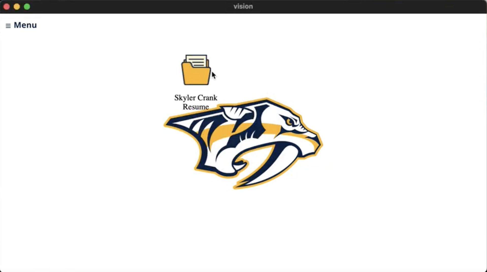
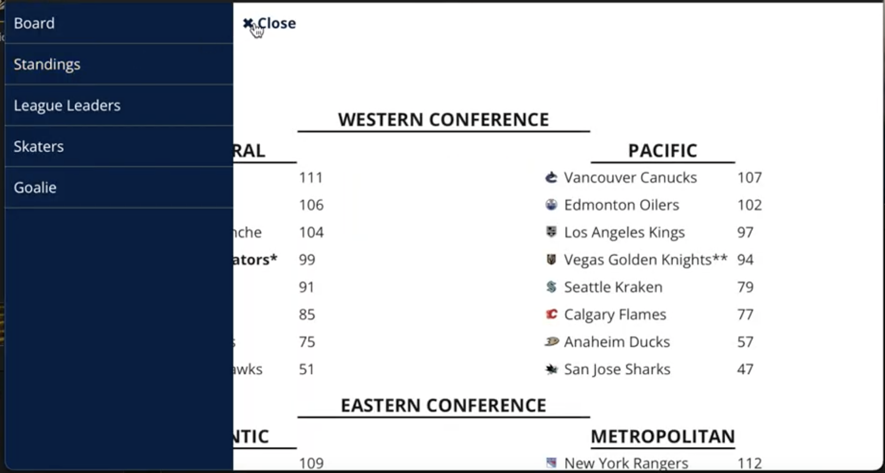
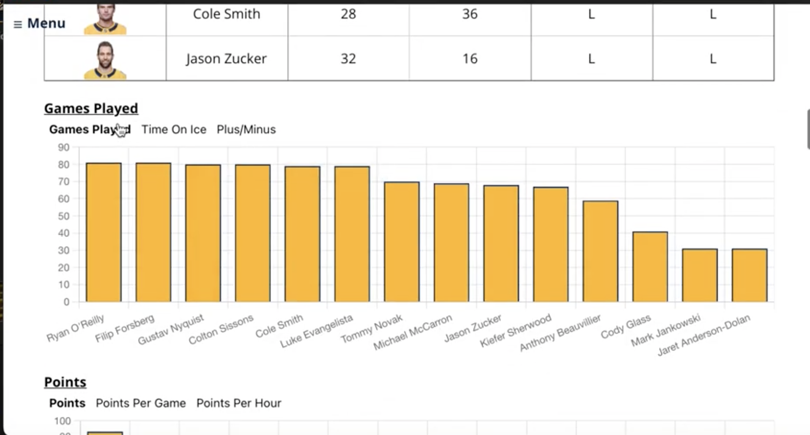
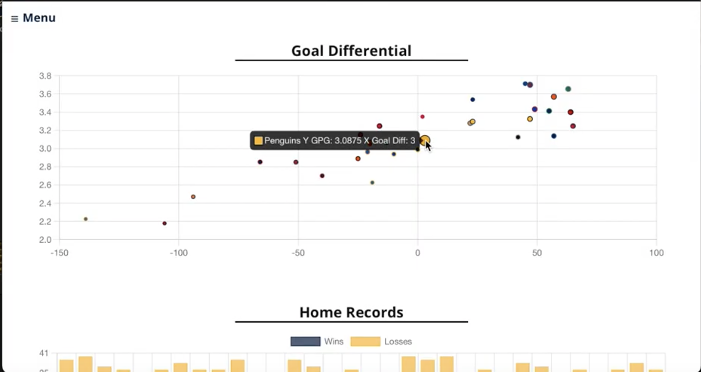

# Vision
### Example Images

  <em>Homepage: Desktop Style Drag and Drop</em>
   
  

  <em>Image 2: Title of Image 2</em>
   
  

  <em>Image 3: Title of Image 3</em>
   
  

  <em>Image 4: Title of Image 4</em>
   
  

  <em>Image 5: Title of Image 5</em>
   
  

